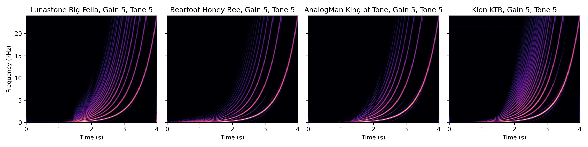
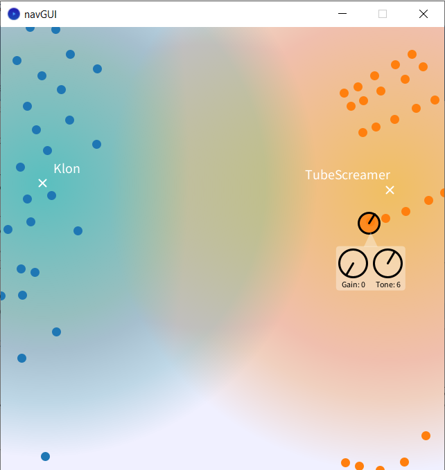
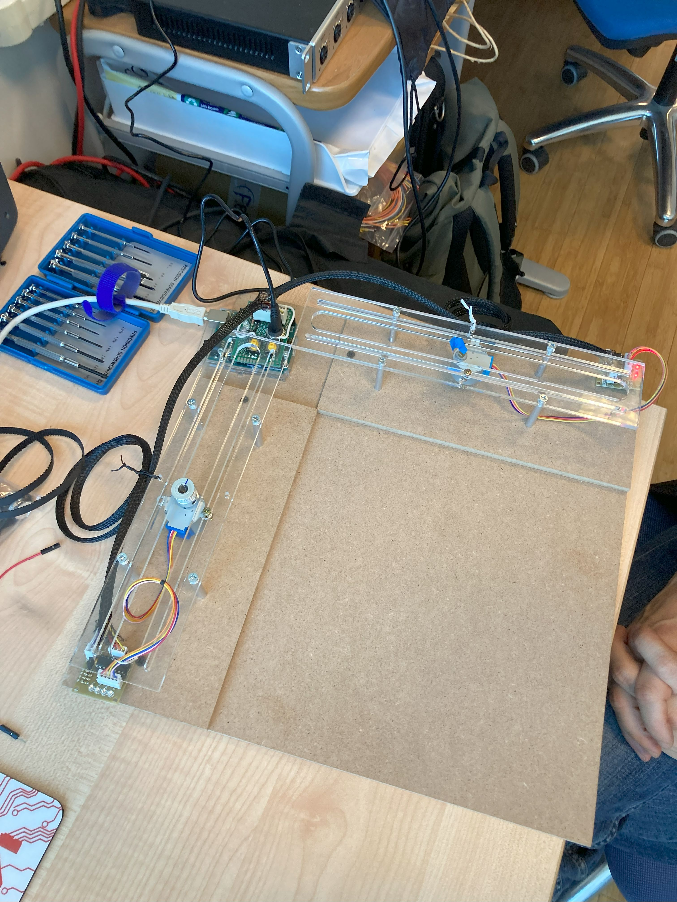

DAFX2025 Morph Overdrive Pedals Project
---

### Dataset

Examples of output signals for different pedals when the input signal is sine sweep.

`overdrive_modeler/network/dataset/sweep_spectrograms.jpg`  

### Recording Robot:

Pictures of the robot created and used to record the dataset.  
Two stepper motors are used to control the position of the gain and tone knobs on the pedal, which is fixed to the base with velcro straps. The motors are controlled by a Pure Data patch via an Arduino board and serial communication. Audio I/O and recording are handled in the same patch.

    

  

    

<!-- ### Neural Modeler -->

### GUI

<!-- 

    

 -->

<!--   -->

## Folders
<!-- - `robotic_database_recorder` - contains the code for the robotic database recorder -->
`docs` - documentation
`overdrive_modeler`  - contains the code for the neural network modeler and GUI
`robotic_database_recorder` -  contains the code for the robotic database recorder

Francesco Ardan Dal Rì  
Domenico Stefani