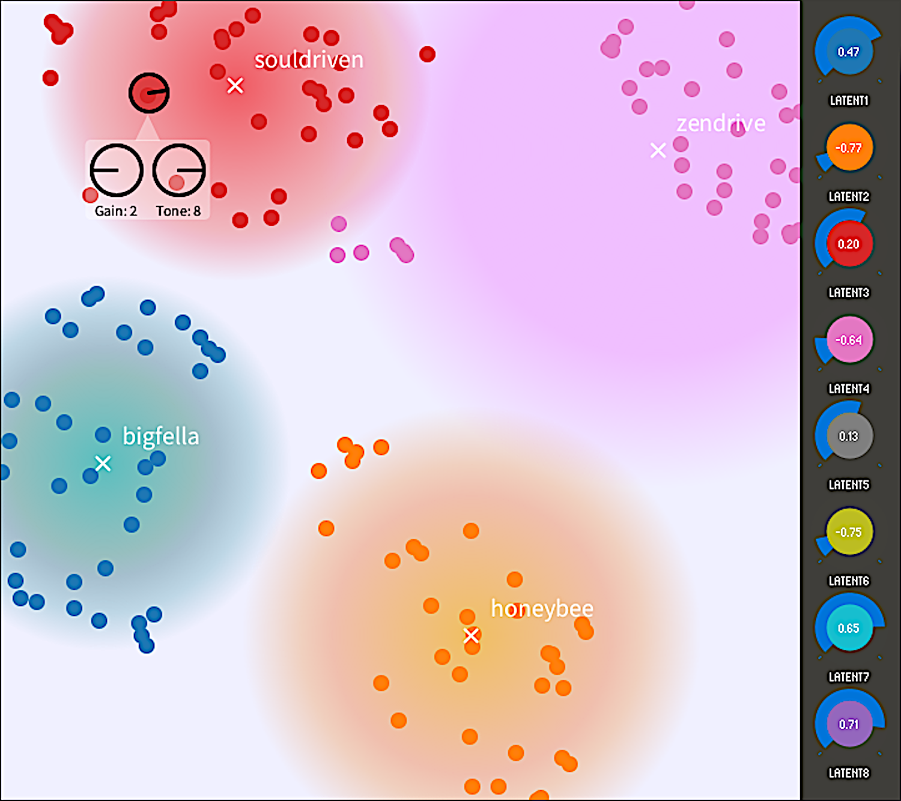

# Morphdrive: Latent Conditioning for Cross-Circuit Effect Modeling

  <!-- 
 -->
    <a href="https://github.com/return-nihil"> Ardan Dal Rì</a>,
    <a href="http://www.domenicostefani.com"> Domenico Stefani</a>,  
    Luca Turchet,
    Nicola Conci
      <!-- 
 -->

<i>University of Trento, Italy</i>

*Accompanying material for "**MorphDrive: Latent Conditioning for Cross-Circuit Effect Modeling and a Parametric Audio Dataset of Analog Overdrive Pedals**"*  
Francesco Ardan Dal Rì, Domenico Stefani, Luca Turchet, Nicola Conci  
in Proceedings of the 28-th Int. Conf. on Digital Audio Effects (DAFx25), 2025, Ancona, Italy.

### 🎵🎧 **[>>Website<<](https://www.domenicostefani.com/morphdrive/)** 🎧🎵  
<i>(with audio samples and more)</i>

<!-- ## Website with Examples

<a href="https://domenicostefani.com/morphdrive" style="margin-bottom:4 rem">www.domenicostefani.com/morphdrive</a> -->

## Abstract

We present an approach to the neural modeling of overdrive guitar pedals with conditioning from a cross-circuit and cross-setting latent space. The resulting networks model the behavior of multiple overdrive pedals across different settings, offering continuous morphing between real configurations and hybrid behaviors. Compact conditioning spaces are obtained through unsupervised training of a variational autoencoder with adversarial training, resulting in accurate reconstruction performance across different sets of pedals. We then compare three Hyper-Recurrent architectures for processing, including dynamic and static HyperRNNs, and a smaller model for real-time processing. Additionally, we present a new open dataset including recordings of 27 analog overdrive pedals, each with 36 gain and tone parameter combinations totaling over 97 hours of recordings. Precise parameter setting was achieved through a custom recording robot.

## **[Preprint <--](https://www.domenicostefani.com/publications/2025DAFx_Morphdrive_PREPRINT.pdf)**

## **[Dataset <---](https://doi.org/10.5281/zenodo.15389652)**

## Folders
<!-- - `robotic_database_recorder` - contains the code for the robotic database recorder -->
`docs` - documentation  
`overdrive_modeler`  - contains the code for the neural network modeler, GUI, and evaluation  
`robotic_database_recorder` -  contains the code for the robotic database recorder  

