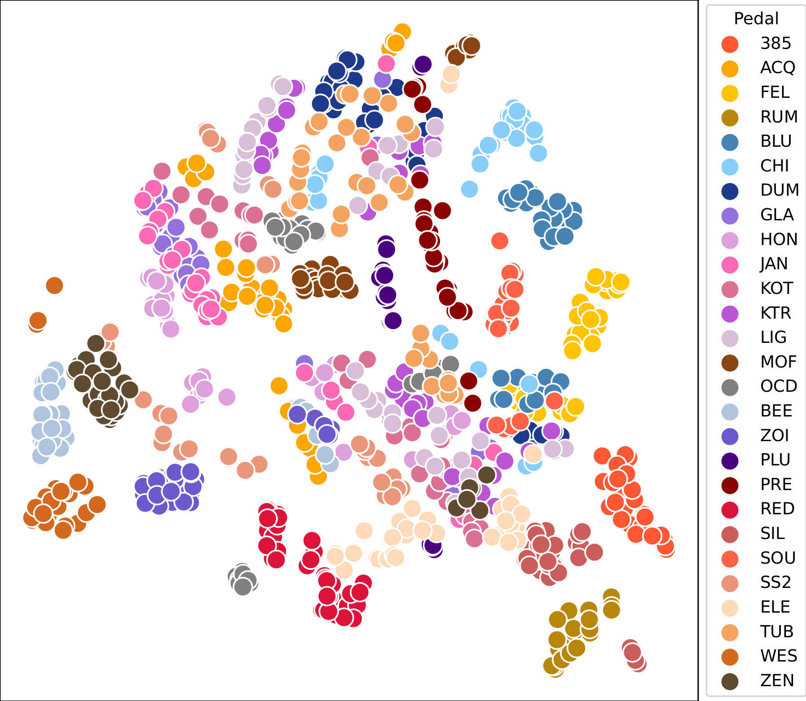

Morphdrive: Latent Conditioning for Cross-Circuit Effect Modeling
---

  <!-- 
 -->
    <a href="https://github.com/return-nihil"> Ardan Dal Rì</a>,
    <a href="http://www.domenicostefani.com"> Domenico Stefani</a>,  
    Luca Turchet,
    Nicola Conci
      <!-- 
 -->

<i>University of Trento, Italy</i>

*Accompanying material for "MorphDrive: Latent Conditioning for Cross-Circuit Effect Modeling and a Parametric Audio Dataset of Analog Overdrive Pedals"*

<!-- ## Website with Examples

<a href="https://domenicostefani.com/morphdrive" style="margin-bottom:4 rem">www.domenicostefani.com/morphdrive</a> -->

## Abstract

We present an approach to the neural modeling of overdrive guitar pedals with conditioning from a cross-circuit and cross-setting latent space. The resulting networks model the behavior of multiple overdrive pedals across different settings, offering continuous morphing between real configurations and hybrid behaviors. Compact conditioning spaces are obtained through unsupervised training of a variational autoencoder with adversarial training, resulting in accurate reconstruction performance across different sets of pedals. We then compare three Hyper-Recurrent architectures for processing, including dynamic and static HyperRNNs, and a smaller model for real-time processing. Additionally, we present a new open dataset including recordings of 27 analog overdrive pedals, each with 36 gain and tone parameter combinations totaling over 97 hours of recordings. Precise parameter setting was achieved through a custom recording robot.

## System Architecture

### Latent Extractor

<!--  -->
2D t-SNE conditioning space reduction for the entire dataset (27 pedals, 36 settings each):  

t-SNE reductions for subsets of the dataset containing 2, 4, and 8 pedals:

<!-- 
### Recording Robot:

Pictures of the robot created and used to record the dataset.  
Two stepper motors are used to control the position of the gain and tone knobs on the pedal, which is fixed to the base with velcro straps. The motors are controlled by a Pure Data patch via an Arduino board and serial communication. Audio I/O and recording are handled in the same patch.

    

  

    

 -->

## Folders
<!-- - `robotic_database_recorder` - contains the code for the robotic database recorder -->
`docs` - documentation  
`overdrive_modeler`  - contains the code for the neural network modeler, GUI, and evaluation  
`robotic_database_recorder` -  contains the code for the robotic database recorder  

## Dataset

pOD-set is a new dataset that comprises a total of 27 guitar pedals, with 36 combinations of parameters for each. Out of the wide range of different overdrive pedals currently available on the market, we selected a set of high-end, boutique pedals spanning from renowned classic circuits to novel, peculiar, and unconventional designs, covering a variety of tonal nuances. The 36 parameter settings represent combinations of the gain and tone knobs, typically found in most overdrive pedals.  
For each knob, we recorded six positions, covering their full range in evenly spaced increments (i.e., 0, 2, 4, 6, 8, and 10 on 10-mark scales). Additional controls, where present, were set to flat/neutral positions.    
Precise parameter setting was achieved through a custom recording robot, which allowed us to record the dataset in a controlled and repeatable manner.

The dataset will soon be available on Zenodo with a [CC BY-NC license](https://creativecommons.org/licenses/by-nc/4.0/).
<!-- : https://zenodo.org/record/TODO -->
The following table lists the pedals included in the dataset:  

<!-- 

 -->

<table class="table">
    <thead>
        <tr>
            <th scope="col">#</th>
            <th scope="col">Label</th>
            <th scope="col">Brand</th>
            <th scope="col">Model</th>
        </tr>
    </thead>
    <tbody>
        <tr>
            <td>1</td>
            <td><code>KOT</code></td>
            <td>AnalogMan</td>
            <td>King of Tone</td>
        </tr>
        <tr>
            <td>2</td>
            <td><code>HON</code></td>
            <td>Bearfoot</td>
            <td>Honey Bee</td>
        </tr>
        <tr>
            <td>3</td>
            <td><code>BEE</code></td>
            <td>Beetronix</td>
            <td>Overhive</td>
        </tr>
        <tr>
            <td>4</td>
            <td><code>WES</code></td>
            <td>Bogner</td>
            <td>Wessex MKII</td>
        </tr>
        <tr>
            <td>5</td>
            <td><code>BLU</code></td>
            <td>Boss</td>
            <td>BD-2-B50A</td>
        </tr>
        <tr>
            <td>6</td>
            <td><code>GLA</code></td>
            <td>Cornerstone</td>
            <td>Gladio</td>
        </tr>
        <tr>
            <td>7</td>
            <td><code>SS2</code></td>
            <td>Cornish</td>
            <td>SS2</td>
        </tr>
        <tr>
            <td>8</td>
            <td><code>ELE</code></td>
            <td>Dr Scientist</td>
            <td>The Elements</td>
        </tr>
        <tr>
            <td>9</td>
            <td><code>PLU</code></td>
            <td>EarthQuaker Devices</td>
            <td>Plumes</td>
        </tr>
        <tr>
            <td>10</td>
            <td><code>OCD</code></td>
            <td>Fulltone</td>
            <td>OCD v1.3</td>
        </tr>
        <tr>
            <td>11</td>
            <td><code>ZEN</code></td>
            <td>Hermida Audio</td>
            <td>Zendrive</td>
        </tr>
        <tr>
            <td>12</td>
            <td><code>PRE</code></td>
            <td>Horizon Devices</td>
            <td>Precision Drive</td>
        </tr>
        <tr>
            <td>13</td>
            <td><code>TUB</code></td>
            <td>Jam Pedals</td>
            <td>Tube Dreamer</td>
        </tr>
        <tr>
            <td>14</td>
            <td><code>KTR</code></td>
            <td>Klon</td>
            <td>KTR</td>
        </tr>
        <tr>
            <td>15</td>
            <td><code>ACQ</code></td>
            <td>Lichtlaerm Audio</td>
            <td>Acquaria</td>
        </tr>
        <tr>
            <td>16</td>
            <td><code>FEL</code></td>
            <td>Lunastone</td>
            <td>Big Fella</td>
        </tr>
        <tr>
            <td>17</td>
            <td><code>CHI</code></td>
            <td>Pettyjohn</td>
            <td>Chime</td>
        </tr>
        <tr>
            <td>18</td>
            <td><code>LIG</code></td>
            <td>Rawkworks</td>
            <td>Light OD</td>
        </tr>
        <tr>
            <td>19</td>
            <td><code>ZOI</code></td>
            <td>SviSound</td>
            <td>Overzoid</td>
        </tr>
        <tr>
            <td>20</td>
            <td><code>DUM</code></td>
            <td>Tanabe</td>
            <td>Dumkudo</td>
        </tr>
        <tr>
            <td>21</td>
            <td><code>RUM</code></td>
            <td>Tone City</td>
            <td>Big Rumble</td>
        </tr>
        <tr>
            <td>22</td>
            <td><code>JAN</code></td>
            <td>Vemuram</td>
            <td>Jan Ray</td>
        </tr>
        <tr>
            <td>23</td>
            <td><code>SIL</code></td>
            <td>Vox</td>
            <td>Silk Drive</td>
        </tr>
        <tr>
            <td>24</td>
            <td><code>RED</code></td>
            <td>Way Huge</td>
            <td>Red Llama*</td>
        </tr>
        <tr>
            <td>25</td>
            <td><code>MOF</code></td>
            <td>Wampler</td>
            <td>Mofetta</td>
        </tr>
        <tr>
            <td>26</td>
            <td><code>385</code></td>
            <td>Walrus Audio</td>
            <td>385 MKII</td>
        </tr>
        <tr>
            <td>27</td>
            <td><code>SOU</code></td>
            <td>Xotic</td>
            <td>Soul Driven</td>
        </tr>
    </tbody>
    <tfoot class="table-footer">
        <tr>
            <td colspan="4">Tot: 27 overdrive pedals, 97 hours 57 minutes</td>
        </tr>
    </tfoot>
</table>

<small>* Modified with Tone control</small>

